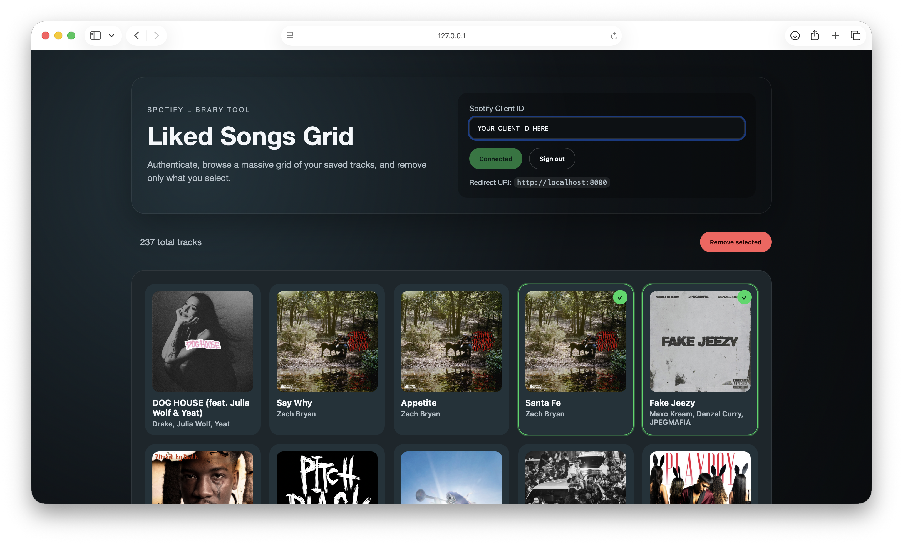

# Spotify Liked Songs Grid

Local web app that authenticates with Spotify, shows a scrolling grid of your liked songs, and lets you remove the tracks you select.



## Setup

1. Visit the Spotify Developer Dashboard: https://developer.spotify.com/dashboard
2. Create an app.
3. Open **Settings** and copy the **Client ID**.
4. Add this Redirect URI and save:
   - `http://127.0.0.1:8000/`

## Run

```bash
python3 -m http.server 8000
```

Open `http://127.0.0.1:8000/`, paste your Client ID, and connect to Spotify. Your liked songs load automatically.

## Permissions

The app requests:
- `user-library-read`
- `user-library-modify`

## Troubleshooting

- If removals fail, sign out, clear storage (`localStorage.clear()`), and connect again to re-grant scopes.
